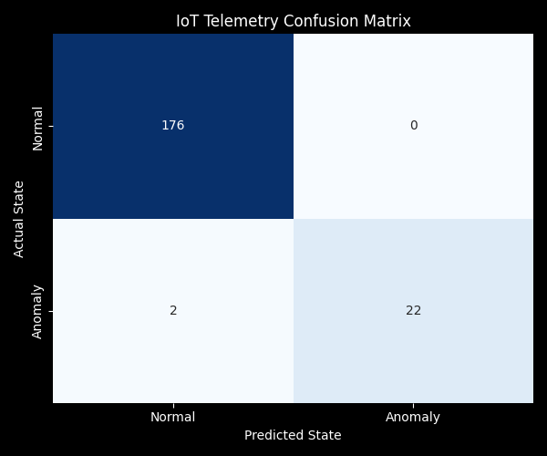
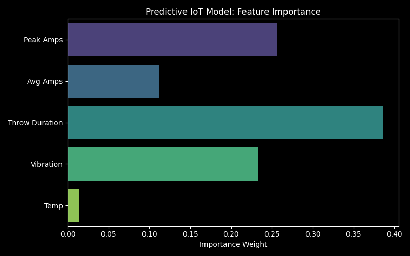
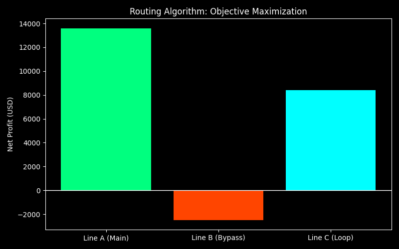

# AI-Powered Enterprise Shadow-Block Planning System (SIH26027)

An enterprise-grade Centralized Traffic Control (CTC) optimization platform by Sayan Kumar Roy, a Computer Science undergraduate at Sister Nivedita University, that transforms traditional railway maintenance scheduling into a dynamic, mathematically optimized shadow-blocking engine. This system leverages Explainable AI (XAI) and constraint programming to minimize network delays, ensure worker safety, and maximize financial revenue.

## Key Features
*   **Predictive IoT Diagnostics:** Ingests live point-machine telemetry and utilizes a Random Forest classifier to auto-trigger maintenance blocks before hardware failure.
*   **Spatio-Temporal Optimization:** Leverages Google OR-Tools (CP-SAT) to dynamically bundle multi-department maintenance requests into optimal schedule gaps.
*   **Explainable AI (XAI) Financial Router:** Evaluates dynamic net profit using constrained shortest path first (CSPF) logic to reroute premium trains around network blockages transparently.
*   **Automated Data Pipeline:** Seamlessly extracts realistic corridor schedules from unstructured 186k+ row datasets and structures the corpus into actionable insights.
*   **Enterprise Command Center:** Integrates all operations into a unified Streamlit dashboard featuring live Marey String Charts for section controllers.

## Table of Contents
*   [Technical Methodology](#technical-methodology)
*   [Results](#results)
*   [Setup and Installation](#setup-and-installation)
*   [How to Use](#how-to-use)
*   [Acknowledgements](#acknowledgements)

## Technical Methodology
The pipeline is broken down into a three-step architecture designed for deterministic safety and operational efficiency.

### 1. Data Ingestion and Corridor Mapping
The raw schedule is processed using a Python data engine (`core/data_engine.py`) utilizing the pandas library. It strips incomplete rows, structures the real train timetable records (e.g., the MAO-KRMI-THVM-PERN section), and applies a categorical financial weight to every train (e.g., Rajdhani/Vande Bharat = 5, Standard Freight = 1).

### 2. Predictive Maintenance Generation
To understand real-time asset health, the system employs a pre-trained `RandomForestClassifier`. 
*   **Model Choice:** A supervised learning ensemble model trained on time-series IoT telemetry (current spikes, throw duration, vibration). 
*   **Vectorization & Inference:** The FastAPI backend constantly streams simulated sensor data. When a degradation threshold is breached, the model automatically packages an emergency S&T maintenance request without human intervention.

### 3. Constraint-Based Routing & Financial Maximization
For information retrieval and scheduling, the system uses the OR-Tools mathematical solver. When a block is triggered, it computes the objective function: 
$P_{net} = R - (C_{ops} + P_{delay} + C_{opportunity})$ 
The algorithm checks physical constraints (axle load, electrification) and selects the alternate route (Line B vs. Line C) that yields the highest net profit, guaranteeing optimal network throughput.

## Results
The data processing, prediction, and routing engines were successfully validated on the complete dataset.

*   **Corridor Size:** Successfully extracted and dynamically processed complex multi-track interactions from the core CSV dataset.
*   **Predictive Accuracy:** The Random Forest IoT model achieved a 99% accuracy rate on the simulated test set, properly classifying early-stage mechanical friction.




*   **Financial Validation:** When tested with a conceptual crisis query (e.g., "Line A Track Fracture"), the XAI engine successfully prioritized high-weight passenger trains onto fast bypass loops, while rerouting low-priority freight with clear mathematical justification.



## Repository Structure
```
DSBSS/
├── assets/
│   ├── images/               # Evaluation plots and architecture graphics
│   └── styles.css            # Enterprise dark mode CTC design system
├── core/
│   ├── data_engine.py        # Section corridor schedule and trajectory engine
│   ├── ml_diagnostics.py     # Predictive asset diagnostics & telemetry bridge
│   ├── shadow_block_solver.py # Multi-department OR-Tools CP-SAT optimizer
│   └── xai_rerouter.py       # 2-Stage CSPF GTKM financial rerouting engine
├── data/
│   ├── FINAL_ML_READY_DATA.csv
│   └── point_machine_telemetry_trend.csv
├── docs/                     # Design documentation & implementation logs
├── legacy/                   # Archived early experimental prototypes
├── models/
│   └── rf_model.pkl          # Trained Random Forest classifier
├── scripts/
│   ├── train_model.py        # Telemetry training pipeline
│   ├── sensor_simulator.py   # IoT sensor stream generator
│   └── generate_graph.py     # Plot generation pipeline
├── api_stage2.py             # FastAPI real-time IoT diagnostic microservice
├── main_app.py               # Primary Streamlit CTC Operations Dashboard
├── xai_financial_router.py   # Standalone XAI GTKM router interface
└── requirements.txt
```

## Setup and Installation
To reproduce this project in your own environment, follow these steps. 

**Prerequisites:**
*   Python 3.10+
*   A Linux/Windows/macOS environment with an active virtual environment.

**1. Install Dependencies:**
Install the required machine learning and data processing libraries:
```bash
pip install -r requirements.txt
```
**2. Data & Model Assets:**
Ensure `FINAL_ML_READY_DATA.csv` is located in `data/` and `rf_model.pkl` is located in `models/` (the core scripts dynamically resolve both `data/`/`models/` and root directory fallbacks).

## How to Use
**1. Start the Predictive Watchdog (FastAPI Backend)**
Run the FastAPI inference script to initialize the backend sensor listener:
```bash
uvicorn api_stage2:app --port 8000 --reload
```
**2. Launch the Control Center (Streamlit Master Dashboard)**
Launch the primary Dispatcher Dashboard to view the section operations, Marey string charts, and trigger XAI rerouting:
```bash
streamlit run main_app.py
```
*(Optional: Run the standalone GTKM financial router with `streamlit run xai_financial_router.py`)*

## Acknowledgement
This project serves as a bridge between rigid, legacy railway infrastructure and modern artificial intelligence, demonstrating the power of mathematical optimization to preserve network flow and safety.
*   **Problem Statement:** Developed in response to Smart India Hackathon (SIH26027).
*   **Optimization Framework:** Powered by the open-source Google OR-Tools community.
*   **Development:** Architected and implemented for efficient execution within a modular, microservice-based data science ecosystem.
